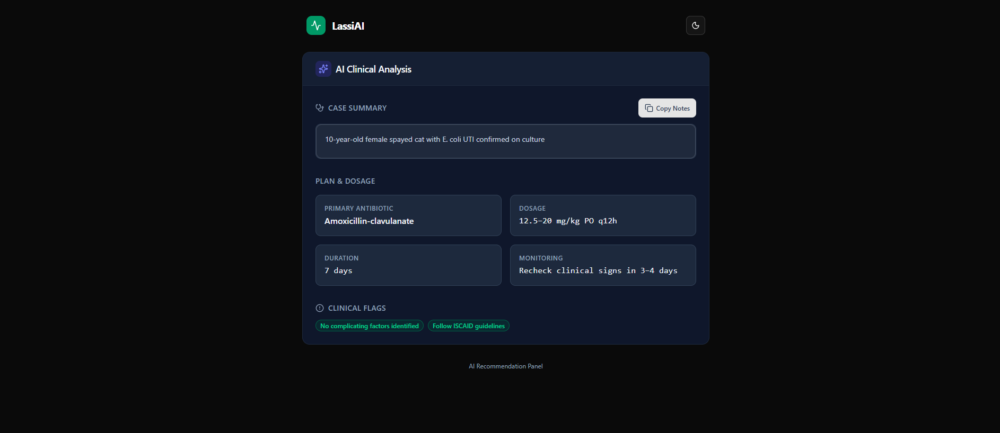

# Clinical AI Recommendations Panel

A high-fidelity, clinical-grade React component designed for displaying AI-generated veterinary treatment recommendations. This project focuses on data clarity, readability, and distinct visual hierarchy suitable for medical interfaces.



## ✨ Features

- **Clinical-Grade UI**: Built with specific attention to contrast, typography (Inter & JetBrains Mono), and whitespace to reduce cognitive load for practitioners.
- **Smart Validation**: Includes a simulated "Context Match" system. If a user alters the clinical summary, the system validates it against the source data, triggering a debounce -> loading -> error workflow to prevent hallucinations or context drift.
- **Interactive Elements**:
  - **Editable Summary**: Auto-resizing textarea with debounce logic.
  - **Patient History**: detailed history view in a modal overlay.
  - **Copy Functionality**: One-click clipboard action with tooltip feedback.
- **Dark Mode Support**: Fully integrated dark theme for low-light clinical environments.
- **Responsive Design**: Adapts seamlessly from desktop to tablet/mobile viewports.

## 🛠 Tech Stack

- **Framework**: React 19
- **Styling**: Tailwind CSS (Utility-first)
- **Icons**: Lucide React
- **Language**: TypeScript

## 📂 Project Structure

```
├── components/
│   ├── Badge.tsx               # Clinical status indicators
│   ├── Modal.tsx               # Reusable dialog overlay
│   ├── RecommendationCard.tsx  # Individual data point display
│   ├── RecommendationsPanel.tsx# Main logic controller & UI
│   └── Skeleton.tsx            # Loading state placeholders
├── hooks/
│   └── useTheme.ts             # Dark/Light mode logic
├── constants.ts                # Mocked clinical data
├── types.ts                    # TypeScript interfaces
├── App.tsx                     # Application entry layout
└── index.tsx                   # React root mount
```

## 🚀 Getting Started

### Prerequisites

- Node.js & npm/yarn (if running locally)
- A modern browser

### Installation

1.  **Clone the repository** (or copy the files into a standard React + Vite/CRA template).
2.  **Install dependencies**:
    ```bash
    npm install react react-dom lucide-react
    # Ensure Tailwind CSS is configured in your project
    ```
3.  **Run the development server**:
    ```bash
    npm run dev
    ```
